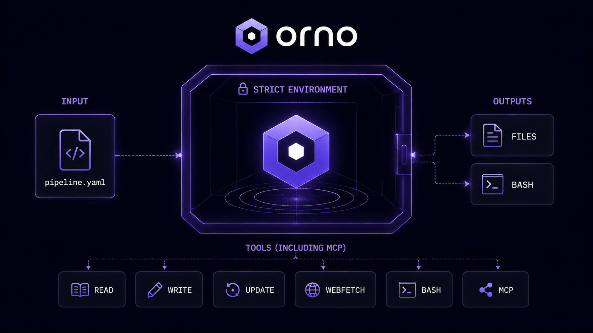

# orno

<p align="center">
  
</p>

<p align="center">
  <a href="https://github.com/DoctorMozg/orno/actions/workflows/ci.yml"></a>
  <a href="https://github.com/DoctorMozg/orno/releases"></a>
  <a href="https://github.com/DoctorMozg/orno/blob/master/LICENSE"></a>
  
</p>

CI-native runner for strict agentic loops.

orno runs LLM agents under a runtime-enforced contract: bounded iteration, bounded tool surface, bounded effects, bounded resources, bounded non-determinism. Every decision is emitted on a versioned event log, and every run can be replayed byte-for-byte without spending tokens.

## Hero surface

### `orno plan` — preview before spend

Static analysis of a pipeline. No LLM calls, no tool execution, no network. Emits one `plan_node` line per node followed by a single `plan_summary` line as NDJSON on stdout. Exit code is `0` iff the pipeline loads, validates, and is spendable.

```console
$ orno plan examples/hello/pipeline.yaml
{"type":"plan_node","node_id":"greet","kind":"agent","depends_on":[],"timeout_secs":null,"agent_name":"greeter","model":"openai/gpt-5","provider":"openrouter","tools":[],"max_iterations":1,"max_total_tokens":1000,"max_tool_calls":0,"allow_mutations":false,"allow_network":false,"allowed_domains":[],"blocked_domains":[]}
{"type":"plan_summary","total_nodes":1,"agent_nodes":1,"shell_nodes":0,"agents_used":["greeter"],"max_iterations_total":1,"max_tokens_total":1000,"max_tool_calls_total":0,"mcp_servers":[],"dag_is_valid":true}
```

Treat it as `terraform plan` for an agent pipeline: a reviewer audits the worst-case ceiling — tokens, tool calls, declared effects, MCP dependencies — before any spend is authorized.

### `orno replay` — replay without tokens

Given a bundle file recorded by a prior run, orno re-executes the pipeline from the recorded LLM and tool tapes. No live LLM calls, no network, no MCP server spawning — every external interaction is served from the bundle. Outputs, exit code, and event log are reproduced bit-for-bit.

Record a bundle:

```bash
orno run examples/hello/pipeline.yaml --record-bundle run.ndjson
```

Replay it:

```bash
orno replay run.ndjson
```

A tape miss during replay is a hard error, not a fallback to the live API.

## The five strictness dimensions

Every `agent` node enforces all five at runtime. A breach terminates the node with the corresponding event on the log.

| Dimension                | What it bounds                                  | Config key(s)                                                                                        |
| ------------------------ | ----------------------------------------------- | ---------------------------------------------------------------------------------------------------- |
| Bounded iteration        | Agent-loop turns                                | `policy.max_iterations`                                                                              |
| Bounded tool surface     | Which tools the model may call                  | `allowed_tools` (builtin names, `mcp.<server>.<tool>`, `subagent.<name>`)                            |
| Bounded effects          | Mutating ops, network calls, domain reach       | `policy.allow_mutations`, `policy.allow_network`, `policy.allowed_domains`, `policy.blocked_domains` |
| Bounded resources        | Total tokens, total tool calls, subagent depth  | `policy.max_total_tokens`, `policy.max_tool_calls`, `policy.max_subagent_depth`                      |
| Bounded non-determinism  | Every LLM call recorded; replay is exact        | `orno run --record-bundle` / `orno replay`                                                           |

Wall-clock deadlines are a node-level attribute (`timeout:`) and apply uniformly to agent and shell nodes.

## Quickstart

### Install

Install the latest release binary for your platform:

```bash
curl --proto '=https' --tlsv1.2 -fsSL https://raw.githubusercontent.com/DoctorMozg/orno/master/install.sh | bash
```

The script downloads `orno` from GitHub Releases into `${CARGO_HOME:-$HOME/.cargo}/bin`. Override the destination with `ORNO_INSTALL_DIR=/path/to/bin` or pin a version with `ORNO_VERSION=v0.1.0`.

Supported targets: `x86_64-unknown-linux-gnu`, `aarch64-apple-darwin`, `x86_64-pc-windows-msvc` (via Git Bash).

### Use as a GitHub Action

Run an orno pipeline from a workflow without managing the binary yourself:

```yaml
- uses: DoctorMozg/orno@v0.1.0
  with:
    pipeline: examples/hello/pipeline.yaml
    command: run                # run | plan | validate | replay (default: run)
    secrets-file: .env.secrets  # optional
    args: --record-bundle run.ndjson  # optional, forwarded to orno
```

Pin to a tagged release (`@v0.1.0`) for reproducibility, or to the major tag (`@v1`) to receive non-breaking patches automatically. The action installs orno into the runner's tool cache and runs your pipeline; outputs are NDJSON on stdout and tracing JSON on stderr, just like a local invocation.

### Build from source

Build from source against the workspace's pinned toolchain (MSRV 1.95):

```bash
git clone https://github.com/DoctorMozg/orno.git
cd orno
cargo build --release -p orno-cli
./target/release/orno --help
```

### Run an example

`examples/hello/pipeline.yaml` calls a real LLM via OpenRouter. To run it without an API key, set the dummy transport — it returns a deterministic canned response:

```bash
ORNO_TEST_LLM_TRANSPORT=dummy cargo run -p orno-cli -- plan examples/hello/pipeline.yaml
ORNO_TEST_LLM_TRANSPORT=dummy cargo run -p orno-cli -- run examples/hello/pipeline.yaml
```

For a real run:

```bash
export OPENROUTER_API_KEY=sk-or-v1-...
cargo run -p orno-cli -- run examples/hello/pipeline.yaml
```

`examples/hello/pipeline.yaml` in full:

```yaml
version: 1

vars:
  target: README.md

agents:
  greeter:
    model: openai/gpt-5
    provider: openrouter
    system: "You are friendly."
    allowed_tools: []
    policy:
      max_iterations: 1
      max_total_tokens: 1000
      max_tool_calls: 0
      max_subagent_depth: 0
      allow_mutations: false
      allow_network: false
      on_parse_error: fail

nodes:
  - id: greet
    kind: agent
    agent: greeter
    initial_prompt: "Say hello to {{ vars.target }} in one sentence."
```

## Pipeline YAML shape

A pipeline declares `vars`, named `agents`, optional `mcp_servers`, and a list of `nodes` forming a DAG. Two node kinds:

- `kind: agent` — runs the strict loop against a named agent. Final assistant message is readable from downstream nodes as `nodes.<id>.output`.
- `kind: shell` — deterministic subprocess. Output is split into `nodes.<id>.stdout`, `.stderr`, and `.exit_code`. Not subject to agent policy.

Templates use MiniJinja with three namespaces: `vars.*`, `env.*` (opt-in pipeline inputs), and `secrets.*` (redacted credentials). See [`docs/reference/pipeline-yaml.md`](docs/reference/pipeline-yaml.md) for the full grammar, and the per-example folders under `examples/` for functionality-heavy samples.

## Commands

- **`orno run <pipeline.yaml>`** — execute a pipeline. NDJSON events to stdout, tracing JSON to stderr.
  Key flags: `-e KEY=VAL`, `--env-file`, `--secrets-file`, `-v` / `--verbose`, `--stderr-tail-bytes`, `--record-bundle`, `--record-tape`, `--replay-tape`, `--record-tool-tape`, `--replay-tool-tape`.
- **`orno validate <pipeline.yaml>`** — load and validate the full policy surface (tool names, agent and MCP references, budget fields).
- **`orno plan <pipeline.yaml>`** — static preview. Emits `plan_node` and `plan_summary` records as NDJSON. No LLM or network.
- **`orno replay <bundle.ndjson>`** — replay a bundle written by `orno run --record-bundle`. No live LLM calls, no network.
- **`orno schema`** — print the pipeline JSON Schema to stdout. Used to regenerate `schemas/pipeline.schema.json`.
- **`orno completions <shell>`** — emit shell completions (bash, zsh, fish, elvish, powershell).

`orno run` separates streams: NDJSON event envelopes go to stdout (downstream tools), tracing JSON goes to stderr (log pipelines). Both timestamps are RFC 3339 UTC, so the two streams join on wall clock. Exit `0` on success; non-zero on pipeline load failure or any node failure.

## Documentation

Documentation lives under [`docs/`](docs/README.md):

- [What is orno](docs/what-is-orno.md) — the runtime contract, in plain English.
- [Install](docs/install.md) — building, running, and verifying a setup.
- Tutorials: [Your first pipeline](docs/tutorials/first-pipeline.md), [Record and replay](docs/tutorials/record-replay.md), [Multi-agent PR review](docs/tutorials/multi-agent-pr-review.md).
- How-to: [MCP servers](docs/how-to/add-mcp-server.md), [Secrets](docs/how-to/pass-secrets.md), [Scoped state](docs/how-to/scope-state-across-nodes.md), [Budget](docs/how-to/tighten-budget.md), [Debugging](docs/how-to/debug-failure.md).
- Reference: [CLI](docs/reference/cli.md), [Pipeline YAML](docs/reference/pipeline-yaml.md), [Tools](docs/reference/tools.md), [Events](docs/reference/events.md), [Errors](docs/reference/errors.md), [Environment variables](docs/reference/env-vars.md), [Exit codes](docs/reference/exit-codes.md).
- Explanation: [Strict agentic loops](docs/explanation/strict-agentic-loops.md), [Comparisons](docs/explanation/comparisons.md), [Security](docs/security.md).
- [Glossary](docs/glossary.md) and [FAQ](docs/faq.md).

Browsable, runnable example pipelines live in [`examples/`](examples/README.md), one folder per example.

## Changelog

See [`CHANGELOG.md`](CHANGELOG.md) for notable changes between releases.

## License

AGPL-3.0-only. See `Cargo.toml` for the canonical SPDX identifier.
