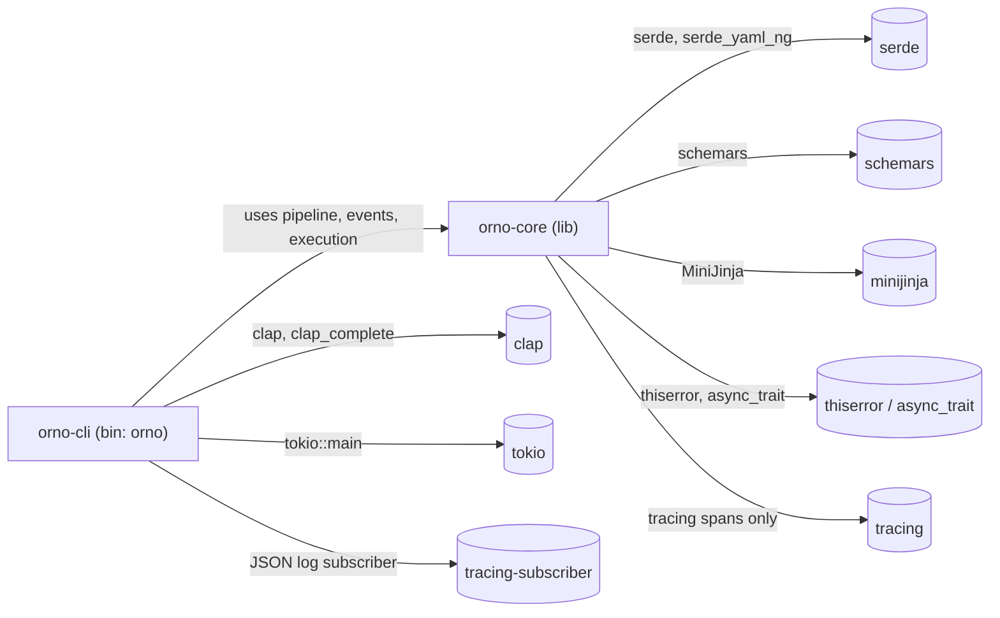
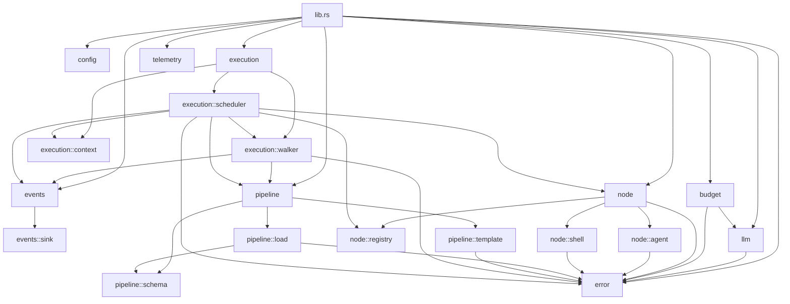
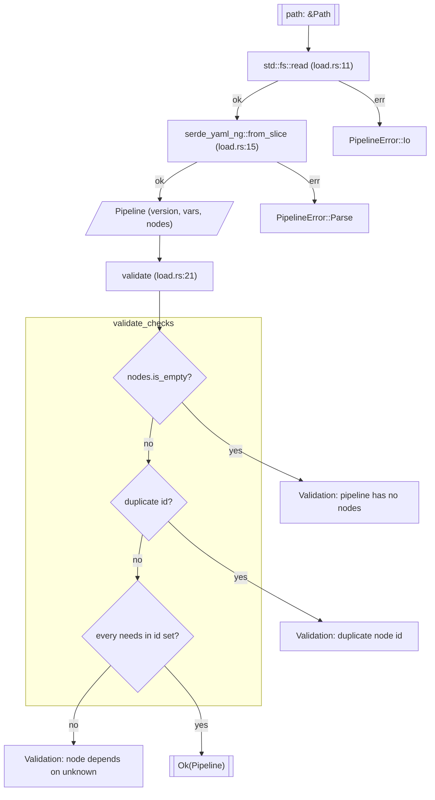
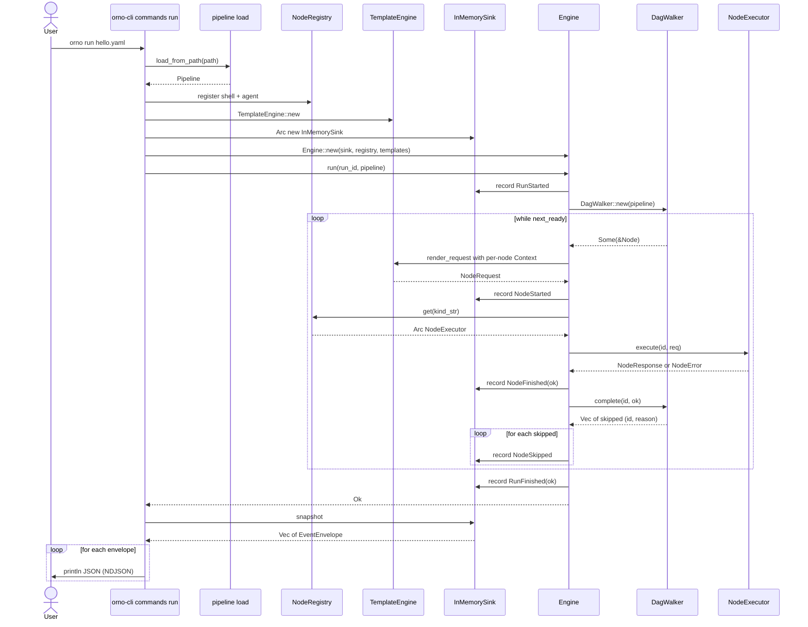
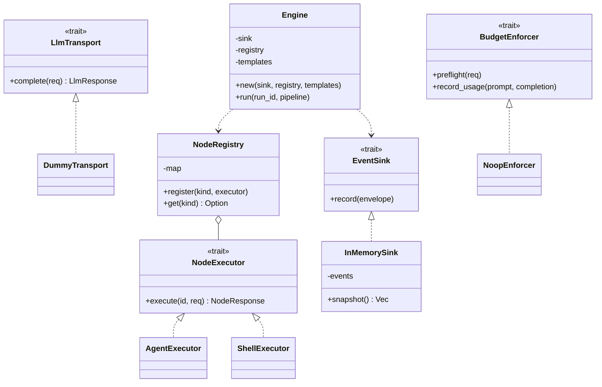
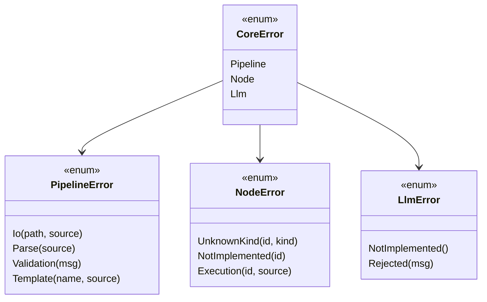
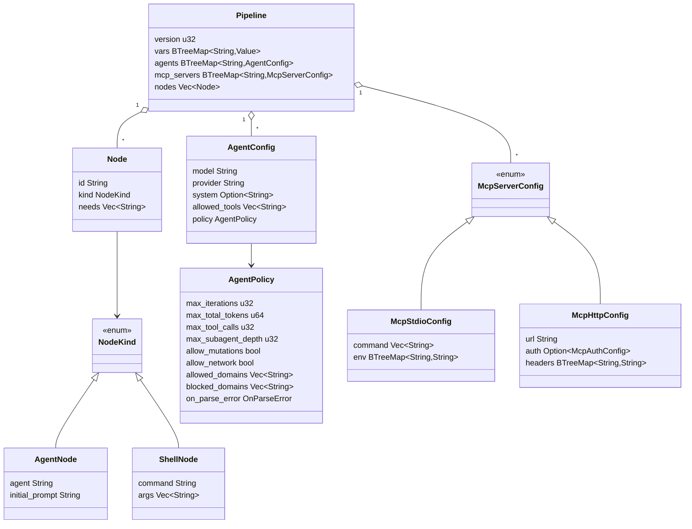
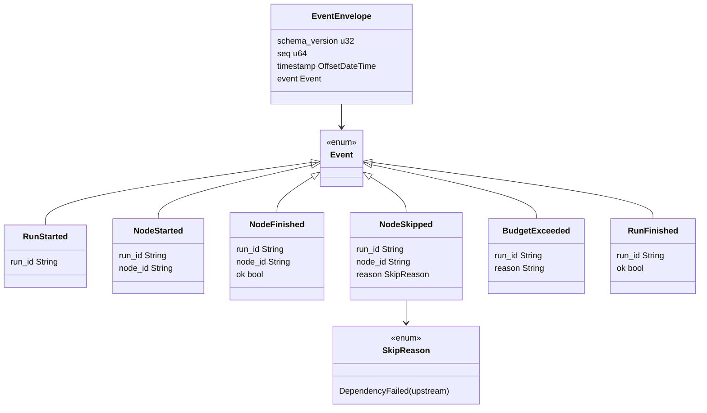
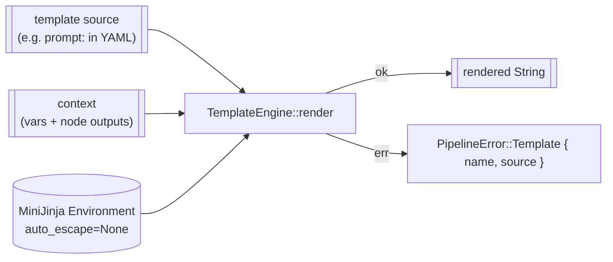

# Flows

Mermaid diagrams describing what's wired today in `crates/orno-core/src/**` and
`crates/orno-cli/src/**`. This is a snapshot of what the live code does.
Seams are in place and the execution path (Engine → walker → NodeRegistry →
NodeExecutor) is wired end-to-end for `shell` nodes; the agent loop is still
a stub pending LLM transport work. ADR targets live in `docs/arch.md` and the
ADRs; this document only describes what the code does.

Every diagram below points at specific file paths. When code moves, update
the diagram in the same commit.

## Crate topology

Two crates, one-way dependency (ADR 0001). `orno-cli` is the only place
`clap` / `tokio::main` / `tracing-subscriber` are wired.



## Module dependency graph — orno-core

Internal modules declared in `crates/orno-core/src/lib.rs:7-15`. Arrows are
`use` edges seen in the code.



`exec_sched` drives the walker and resolves each ready node through
`NodeRegistry`, then merges per-node `Context` snapshots before template
rendering.

## CLI command dispatch

`crates/orno-cli/src/main.rs:10-21` parses `Cli` and branches into one of
four handlers. Only `run` reaches `orno-core`'s execution engine; the other
three touch just the loader or schema emitter.


Stream discipline (`main.rs:26-33`): stdout carries user-consumable output
(NDJSON envelopes, schema, completions). Stderr carries `tracing` JSON via
the subscriber installed in `init_tracing`.

## Pipeline load and validation

`pipeline::load::load_from_path` (`pipeline/load.rs:10-18`) is the single
entry point from the CLI. Validation catches the two constraints serde
cannot: non-empty nodes, unique ids, and known deps.



## `orno run` — end-to-end data flow

`commands::run::run` composes the pieces. The `Engine` records lifecycle
events into an `InMemorySink`; after the engine returns, the CLI drains
the sink and prints each envelope as NDJSON. `Engine::run` drives a
`DagWalker`: `next_ready` hands out nodes whose `needs:` have completed,
each is rendered against its per-node `Context` and dispatched through
`NodeRegistry::get(kind_str).execute(id, req)`, the result feeds back via
`walker.complete(id, ok)`, and on failure the walker returns the
transitively-dependent node ids to emit as `NodeSkipped` (see ADR 0021).



What remains stubbed: the `AgentExecutor` still returns `NotImplemented`;
`LlmTransport`, budget enforcement, MCP, and subagents are absent from the
path. Shell nodes dispatch through the real `ShellExecutor`; agent nodes
compile and dispatch but fail at execute time until Phase 4 lands.

## Seams and implementors

Traits and their concrete implementors in the current tree. Dashed
`implements` edges are placeholder/default impls that exist only to keep
the seam live.



Concrete implementor locations:

- `DummyTransport` — `crates/orno-core/src/llm/dummy.rs:11`
- `AgentExecutor` — `crates/orno-core/src/node/agent.rs:11` (stateless stub; the real loop composes `LlmTransport` + tool handlers per ADRs 0005, 0008)
- `ShellExecutor` — `crates/orno-core/src/node/shell.rs:16` (real `tokio::process::Command` dispatch; ADR 0013 effects-declaration deferred)
- `InMemorySink` — `crates/orno-core/src/events/in_memory_sink.rs:13`
- `NoopEnforcer` — `crates/orno-core/src/budget/mod.rs:22` (no-op; stays alongside the trait per the Rust-idioms rule in `CLAUDE.md`)
- `Engine` — `crates/orno-core/src/execution/scheduler.rs:24`

Seams that ADRs 0005–0008 call for but are **not yet in the code**: `Agent`,
`ToolHandler`, `McpClient`. Do not add these without a working consumer.

## Error hierarchy

`crates/orno-core/src/error.rs`. `CoreError` re-exported from `lib.rs:17`
is the top-level facade; CLI dispatch boundaries use `anyhow::Result` and
rely on `#[from]` / `#[source]` chaining for readable diagnostics.



`CoreError` conversions are all `#[from]` (`error.rs:8-16`). Struct-variant
fields (`Io`, `Template`, `UnknownKind`, `NotImplemented`, `Execution`) are
rendered above as method-style `(…)` for mermaid compatibility; the Rust
code uses named-field structs.

Conversion conventions (per `CLAUDE.md` dependency discipline): `#[from]`
only where the variant carries no extra context; otherwise `#[source]`
with a struct variant. `LlmError` has no `#[from]` today because every
call site wraps it with node id context in `NodeError::Execution`.

## Data model — pipeline schema

`crates/orno-core/src/pipeline/schema.rs`. This is the serde-facing YAML
shape consumed by `load_from_path`. `NodeKind` is `#[non_exhaustive]` and
discriminated by `kind:` in YAML.



`NodeKind` is serialized with `#[serde(tag = "kind", rename_all =
"snake_case")]`, so the YAML discriminator is `kind: agent|shell` (ADR
0009 collapsed `llm` into `agent`; ADR 0017 §3 removed the former
`external` variant entirely). `Node` flattens its `NodeKind` variant via
`#[serde(flatten)]` (`schema.rs:40`). `McpServerConfig` uses the same
internal-tag pattern on `transport:` for `stdio` vs `http`.

## Data model — event envelope

`crates/orno-core/src/events/mod.rs`. `schema_version` on the envelope and
`#[non_exhaustive]` on `Event` are the forward-compatibility hinges.
`timestamp` is a human-readable RFC 3339 UTC correlator (ADR 0018) that
lets stdout event lines and stderr tracing lines be joined on wall
clock without a decoder.



`Event` is serialized with `#[serde(tag = "type", rename_all =
"snake_case")]` (`events/mod.rs:50`), so lifecycle events on the wire
carry `"type": "run_started" | "node_started" | ...`. `CURRENT_SCHEMA_VERSION
= 1` is the value written into every envelope today. `timestamp` is
serialized via `time::serde::rfc3339` — wire form is a JSON string like
`"2026-04-21T18:31:54.387860Z"`. `EventEnvelope::new(seq, event)` is
the single construction site; no scheduler path builds an envelope by
hand.

Emission today: the engine emits `RunStarted`, `NodeStarted`/`NodeFinished`
pairs, and `RunFinished`. `NodeSkipped` is emitted for every transitively-
dependent node of a failed node; `upstream` names the originating failure,
not the direct parent (ADR 0021). `BudgetExceeded` has no emitter yet — it
exists for the budget seam to wire into.

## NodeExecutor dispatch — live path

`Engine::run` calls `NodeRegistry::get(kind_str).execute(id, req)` for each
ready node (`execution/scheduler.rs`). `ShellExecutor::execute` runs a
subprocess via `tokio::process::Command`; `AgentExecutor::execute` still
returns `NotImplemented` pending the Phase 4 agent loop.

```mermaid
sequenceDiagram
    participant Eng as Engine
    participant Reg as NodeRegistry
    participant Ex as NodeExecutor
    participant Tx as LlmTransport
    participant Sink as EventSink

    Eng->>Sink: record NodeStarted
    Eng->>Reg: get(kind_str)
    Reg-->>Eng: Some executor
    Eng->>Ex: execute(id, NodeRequest)
    alt NodeRequest Agent
        Note over Ex: AgentExecutor returns NotImplemented today; the ADR 0005 loop lands in Phase 4
        Ex->>Tx: complete(LlmRequest) per iteration
        Tx-->>Ex: LlmResponse
        Ex-->>Eng: NodeResponse (final assistant msg, usage)
    else NodeRequest Shell
        Note over Ex: ShellExecutor spawns subprocess (ADR 0013)
        Ex-->>Eng: NodeResponse (stdout, stderr, exit_code)
    end
    Eng->>Sink: record NodeFinished
```

Kind translation lives in `node::mod.rs` (`from_kind`, `kind_str`,
`render_request`); the scheduler delegates to those helpers without
matching on `NodeKind` itself.

## Template rendering

`pipeline::template::TemplateEngine` (`pipeline/template.rs`) wraps
MiniJinja with `auto_escape` forced to `None`. The CLI constructs it in
`commands::run::run` and passes it to `Engine::new`; the scheduler
renders each node's `NodeRequest` through `node::render_request` against
the per-node `Context` snapshot before dispatching. `vars`, `env`, and
`nodes.<id>.output` are the in-scope namespaces (yaml-spec.md). Agent
`prompt:` templates will consume the same engine once the Phase 4 agent
loop lands.


