# Flows

Mermaid diagrams describing what's wired today in `crates/orno-core/src/**` and
`crates/orno-cli/src/**`. This is a snapshot of the skeleton — seams are in
place, but most execution paths are deliberate stubs. ADR targets live in
`docs/arch.md` and the ADRs; this document only describes what the code does.

Every diagram below points at specific file paths. When code moves, update
the diagram in the same commit.

## Crate topology

Two crates, one-way dependency (ADR 0001). `orno-cli` is the only place
`clap` / `tokio::main` / `tracing-subscriber` are wired.

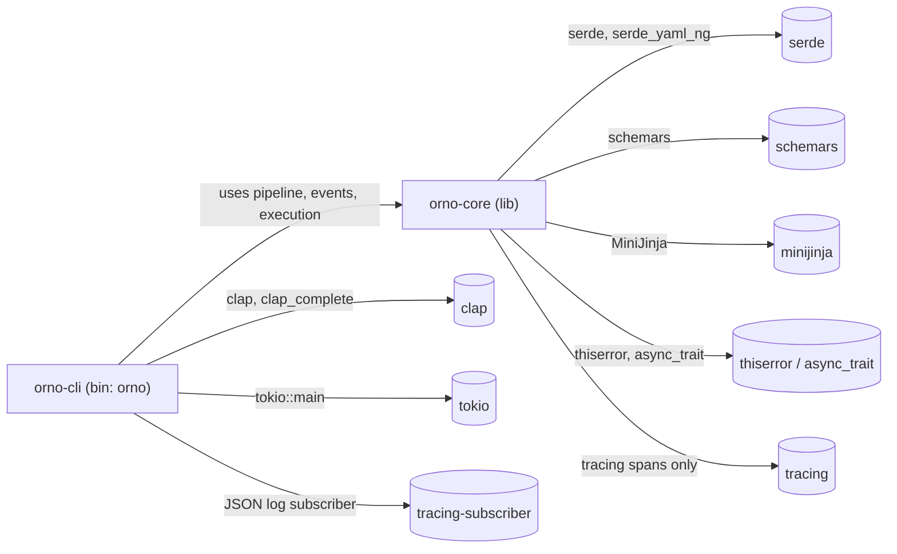

## Module dependency graph — orno-core

Internal modules declared in `crates/orno-core/src/lib.rs:7-15`. Arrows are
`use` edges seen in the code.

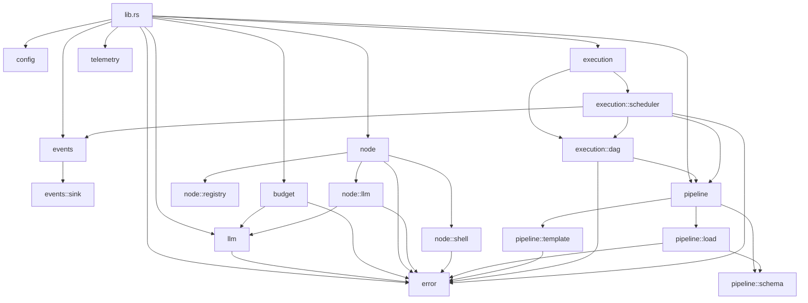

Note the gap: `exec_sched` does **not** depend on `node` or `node::registry`
yet. Node kinds and their executors are unreachable from the live
scheduler — they exist as pre-built seams.

## CLI command dispatch

`crates/orno-cli/src/main.rs:10-21` parses `Cli` and branches into one of
four handlers. Only `run` reaches `orno-core`'s execution engine; the other
three touch just the loader or schema emitter.

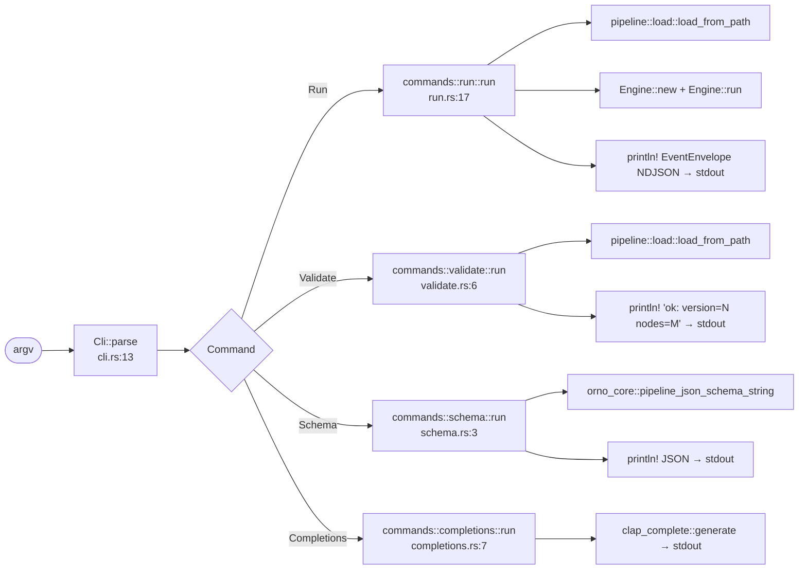

Stream discipline (`main.rs:26-33`): stdout carries user-consumable output
(NDJSON envelopes, schema, completions). Stderr carries `tracing` JSON via
the subscriber installed in `init_tracing`.

## Pipeline load and validation

`pipeline::load::load_from_path` (`pipeline/load.rs:10-18`) is the single
entry point from the CLI. Validation catches the two constraints serde
cannot: non-empty nodes, unique ids, and known deps.

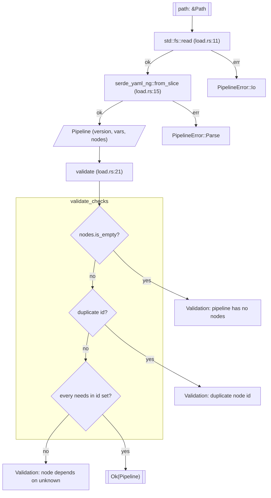

## `orno run` — end-to-end data flow

`commands::run::run` composes the pieces. The `Engine` records lifecycle
events into an `InMemorySink`; after the engine returns, the CLI drains
the sink and prints each envelope as NDJSON. Node execution itself is not
wired — the scheduler emits synthetic `NodeStarted`/`NodeFinished{ok:true}`
for every node in source order (`execution/scheduler.rs:42-66`).

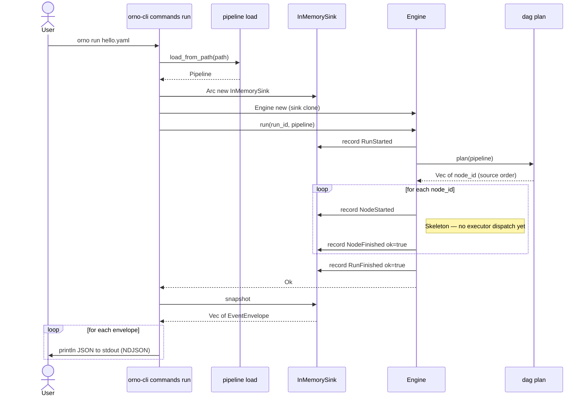

What is **not** wired yet (reflected in the diagram's `Note`): the scheduler
never calls `NodeRegistry::get`, `NodeExecutor::execute`, or any
`LlmTransport`. Budget enforcement, MCP, subagents, and the agent loop are
all absent from this path.

## Seams and implementors

Traits and their concrete implementors in the current tree. Dashed
`implements` edges are placeholder/default impls that exist only to keep
the seam live.

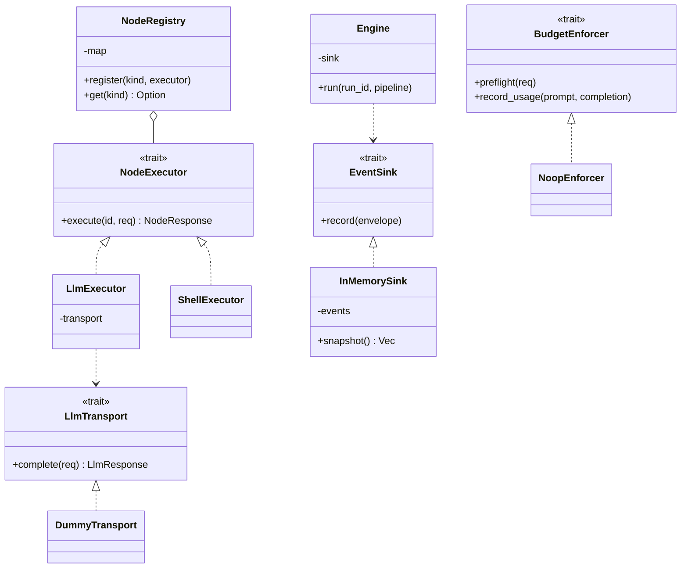

Concrete implementor locations:

- `DummyTransport` — `crates/orno-core/src/llm/mod.rs:50`
- `LlmExecutor` — `crates/orno-core/src/node/llm.rs:23`, composes `Arc<dyn LlmTransport>`
- `ShellExecutor` — `crates/orno-core/src/node/shell.rs:13`
- `InMemorySink` — `crates/orno-core/src/events/sink.rs:37`
- `NoopEnforcer` — `crates/orno-core/src/budget/mod.rs:25`
- `Engine` — `crates/orno-core/src/execution/scheduler.rs:11`

Seams that ADRs 0005–0008 call for but are **not yet in the code**: `Agent`,
`ToolHandler`, `McpClient`. Do not add these without a working consumer.

## Error hierarchy

`crates/orno-core/src/error.rs`. `CoreError` re-exported from `lib.rs:17`
is the top-level facade; CLI dispatch boundaries use `anyhow::Result` and
rely on `#[from]` / `#[source]` chaining for readable diagnostics.

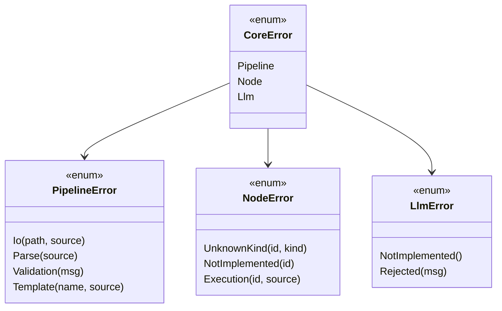

`CoreError` conversions are all `#[from]` (`error.rs:8-16`). Struct-variant
fields (`Io`, `Template`, `UnknownKind`, `NotImplemented`, `Execution`) are
rendered above as method-style `(…)` for mermaid compatibility; the Rust
code uses named-field structs.

Conversion conventions (per `CLAUDE.md` dependency discipline): `#[from]`
only where the variant carries no extra context; otherwise `#[source]`
with a struct variant. `LlmError` has no `#[from]` today because every
call site wraps it with node id context in `NodeError::Execution`.

## Data model — pipeline schema

`crates/orno-core/src/pipeline/schema.rs`. This is the serde-facing YAML
shape consumed by `load_from_path`. `NodeKind` is `#[non_exhaustive]` and
discriminated by `kind:` in YAML.

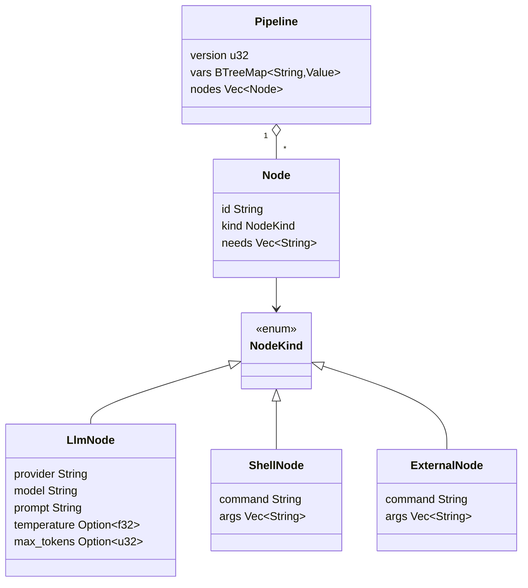

`NodeKind` is serialized with `#[serde(tag = "kind", rename_all =
"snake_case")]`, so the YAML discriminator is `kind: llm|shell|external`.
`Node` flattens its `NodeKind` variant via `#[serde(flatten)]`
(`schema.rs:27`).

Drift note: ADR 0009 collapses `llm` into `agent`. The current skeleton
still ships `NodeKind::Llm`. When the migration lands, this diagram and
`schemas/pipeline.schema.json` move together.

## Data model — event envelope

`crates/orno-core/src/events/mod.rs`. `schema_version` on the envelope and
`#[non_exhaustive]` on `Event` are the forward-compatibility hinges.

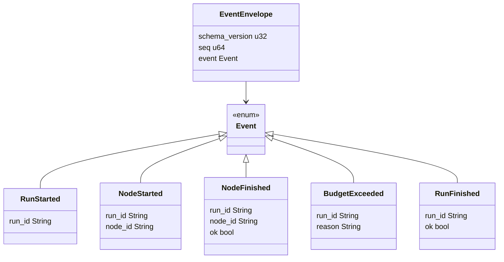

`Event` is serialized with `#[serde(tag = "type", rename_all =
"snake_case")]` (`events/mod.rs:22`), so lifecycle events on the wire
carry `"type": "run_started" | "node_started" | ...`. `CURRENT_SCHEMA_VERSION
= 1` is the value written into every envelope today.

Emission today: the engine emits `RunStarted`, `NodeStarted`/`NodeFinished`
pairs, and `RunFinished`. `BudgetExceeded` has no emitter yet — it exists
for the budget seam to wire into.

## NodeExecutor dispatch (designed but not wired)

`LlmExecutor::execute` (`node/llm.rs:24-58`) already delegates through
`LlmTransport`. `NodeRegistry` (`node/registry.rs`) already keys executors
by kind. They are simply not called from `Engine::run`. This is the shape
the dispatch will take once the scheduler is wired:

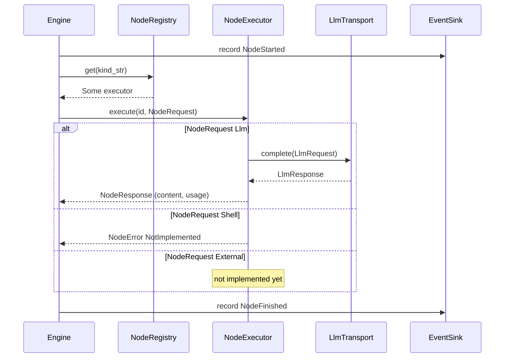

Mapping gap to close when wiring: `pipeline::schema::NodeKind` (YAML-side)
and `node::NodeRequest` (executor-side) are parallel enums today with no
conversion between them. The scheduler will need a translator — either a
`From<&Node> for NodeRequest` impl or an explicit builder — before the
dispatch above can run.

## Template rendering

`pipeline::template::TemplateEngine` (`pipeline/template.rs`) wraps
MiniJinja with `auto_escape` forced to `None`. It is constructed nowhere
in the live call path yet; it exists for the agent loop to render
`prompt:` and other user-supplied templates with pipeline `vars` as
context.

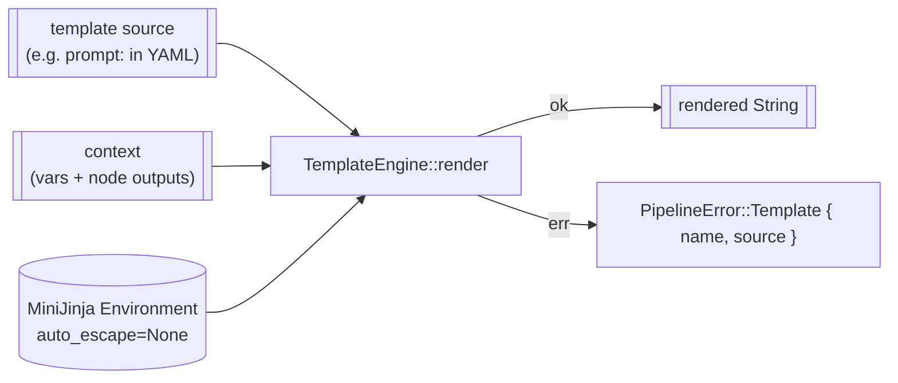
